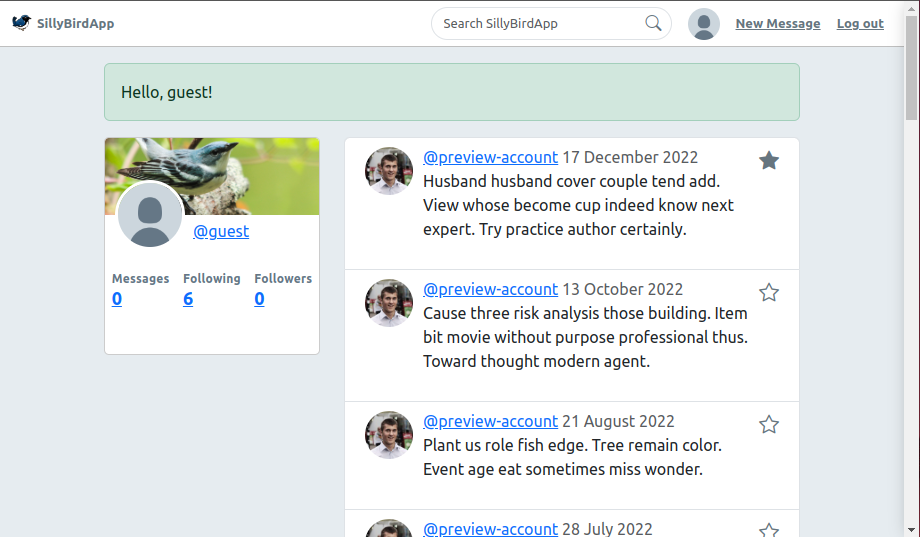

<a name="readme-top"></a>
<!-- PROJECT SHIELDS -->
<!--
*** I'm using markdown "reference style" links for readability.
*** Reference links are enclosed in brackets [ ] instead of parentheses ( ).
*** See the bottom of this document for the declaration of the reference variables
*** for contributors-url, forks-url, etc. This is an optional, concise syntax you may use.
*** https://www.markdownguide.org/basic-syntax/#reference-style-links
-->

<div align="center"></div>

<h3 align="center">Silly Bird App</h3>

  <p align="center">
    <br />
    <a href="https://github.com/jclark1913/warbler"><strong>View documentation »</strong></a>
    <br />
    <br />
    <a href="sillybird.justinclark.bio">View Demo</a>
    ·
    <a href="https://github.com/jclark1913/warbler/issues">Report Bug</a>
    ·
    <a href="https://github.com/jclark1913/warbler/issues">Request Feature</a>
  </p>
</div>

<!-- TABLE OF CONTENTS -->
<details>
  <summary>Table of Contents</summary>
  <ol>
    <li>
      <a href="#about-the-project">About The Project</a>
      <ul>
        <li><a href="#built-with">Built With</a></li>
      </ul>
    </li>
    <li>
      <a href="#getting-started">Getting Started</a>
    </li>
    <li><a href="#license">License</a></li>
    <li><a href="#contact">Contact</a></li>
    <li><a href="#acknowledgments">Acknowledgments</a></li>
  </ol>
</details>


<!-- ABOUT THE PROJECT -->
## About The Project

![Product Name Screen Shot][product-screenshot]

Silly Bird App is a social media platform not unlike another silly bird app you might be familiar with. Users can create
accounts, follow other users, make posts, like posts as well as edit their profile and posts. I launched this project in spring 2023 as part of <a href="rithmschool.com">Rithm School's</a> curriculum, and despite some light refactoring since then I've mostly transitioned to creating <a href="https://github.com/jclark1913/syria-daily-brief">other projects</a>.

Silly Bird is a Flask app that uses Postgresql for its database with SQLAlchemy as an ORM. User data is securely handled via the bcrypt library, which salts and hashes passwords through one-way encryption. Pages are rendered from html templates designed with Jinja and JQuery styled in Bootstrap.

<p align="right">(<a href="#readme-top">back to top</a>)</p>

### Built With

<div align="center">

![Flask][Flask]
![Python][Python]
![Jinja][Jinja]
![SQLAlchemy][SQLAlchemy]
![PostgreSQL][PostgreSQL]
![WTForms][WTForms]
![Bcrypt][Bcrypt]
![Jquery][Jquery]
![Bootstrap][Bootstrap]

</div>

<p align="right">(<a href="#readme-top">back to top</a>)</p>


<!-- GETTING STARTED -->
## Getting Started

To see the project in action, visit the <a href="sillybird.justinclark.bio">demo</a>.

Otherwise, to build Silly Bird App from source:

1. Clone the repo:

```bash
git clone https://github.com/jclark1913/warbler
```

2. Create and seed the database

```bash
createdb warbler
cd warbler
python3 seed.py
```

3. Create a virtual environment (venv) inside the root directory (optional but recommended)

```bash
cd warbler
python3 -m venv venv
source venv/bin/activate
```

4. Install dependencies and run the backend server (defaults to port `5000`)

```bash
cd warbler
pip3 install -r requirements.txt
flask run
```

4. Visit `localhost:5000`

<p align="right">(<a href="#readme-top">back to top</a>)</p>


<!-- LICENSE -->
## License

Distributed under the MIT License. See `LICENSE.txt` for more information.

<p align="right">(<a href="#readme-top">back to top</a>)</p>


<!-- CONTACT -->
## Contact

Justin Clark - [@JustinClarkJO](https://twitter.com/@JustinClarkJO) - jclarksummit@gmail.com

Project Link: [https://github.com/jclark1913/warbler](https://github.com/jclark1913/warbler)

<p align="right">(<a href="#readme-top">back to top</a>)</p>


<!-- ACKNOWLEDGMENTS -->
## Acknowledgments

I completed this project during my time at [Rithm School](https://rithmschool.com). A big thanks to all the instructors
and classmates who encouraged and supported me during that time.

* [Rithm School](https://rithmschool.com)
* [Best-README-Template](https://github.com/othneildrew/Best-README-Template)

<p align="right">(<a href="#readme-top">back to top</a>)</p>


<!-- MARKDOWN LINKS & IMAGES -->
<!-- https://www.markdownguide.org/basic-syntax/#reference-style-links -->
[contributors-shield]: https://img.shields.io/github/contributors/jclark1913/warbler.svg?style=for-the-badge
[contributors-url]: https://github.com/jclark1913/warbler/graphs/contributors
[forks-shield]: https://img.shields.io/github/forks/jclark1913/warbler.svg?style=for-the-badge
[forks-url]: https://github.com/jclark1913/warbler/network/members
[stars-shield]: https://img.shields.io/github/stars/jclark1913/warbler.svg?style=for-the-badge
[stars-url]: https://github.com/jclark1913/warbler/stargazers
[issues-shield]: https://img.shields.io/github/issues/jclark1913/warbler.svg?style=for-the-badge
[issues-url]: https://github.com/jclark1913/warbler/issues
[license-shield]: https://img.shields.io/github/license/jclark1913/warbler.svg?style=for-the-badge
[license-url]: https://github.com/jclark1913/warbler/blob/master/LICENSE.txt
[linkedin-shield]: https://img.shields.io/badge/-LinkedIn-black.svg?style=for-the-badge&logo=linkedin&colorB=555
[linkedin-url]: https://linkedin.com/in/linkedin_username
[product-screenshot]: docs/main.png
[React]: https://img.shields.io/badge/React-61DAFB?logo=react&logoColor=white
[React.js]: https://img.shields.io/badge/React-20232A?style=for-the-badge&logo=react&logoColor=61DAFB
[React-url]: https://reactjs.org/
[Bootstrap.com]: https://img.shields.io/badge/Bootstrap-563D7C?style=for-the-badge&logo=bootstrap&logoColor=white
[Bootstrap-url]: https://getbootstrap.com
[PostgreSQL]: https://img.shields.io/badge/PostgreSQL-4169E1?logo=postgresql&logoColor=white
[ElephantSQL]: https://img.shields.io/badge/ElephantSQL-2D9CDB?logo=elephantsql&logoColor=white
[Render]: https://img.shields.io/badge/Render-000000?logo=render&logoColor=white
[Express]: https://img.shields.io/badge/Express-000000?logo=express&logoColor=white
[Node.js]: https://img.shields.io/badge/Node.js-339933?logo=node.js&logoColor=white
[React Router]: https://img.shields.io/badge/React_Router-CA4245?logo=react-router&logoColor=white
[Flask]: https://img.shields.io/badge/Flask-007D69?logo=flask&logoColor=white
[Gunicorn]: https://img.shields.io/badge/Gunicorn-492548?logo=gunicorn&logoColor=white
[Python]: https://img.shields.io/badge/Python-3776AB?logo=python&logoColor=white
[Bcrypt]: https://img.shields.io/badge/Bcrypt-FF5700?logo=bcrypt&logoColor=white
[Jinja]: https://img.shields.io/badge/Jinja-B41717?logo=jinja&logoColor=white
[PostgreSQL]: https://img.shields.io/badge/PostgreSQL-316192?logo=postgresql&logoColor=white
[WTForms]: https://img.shields.io/badge/WTForms-2D9CDB?logo=wtforms&logoColor=white
[SQLAlchemy]: https://img.shields.io/badge/SQLAlchemy-1C2833?logo=sqlalchemy&logoColor=white
[Bootstrap]: https://img.shields.io/badge/Bootstrap-563D7C?logo=bootstrap&logoColor=white
[jQuery]: https://img.shields.io/badge/jQuery-0769AD?logo=jquery&logoColor=white
